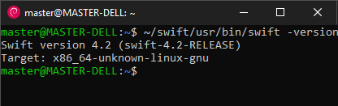
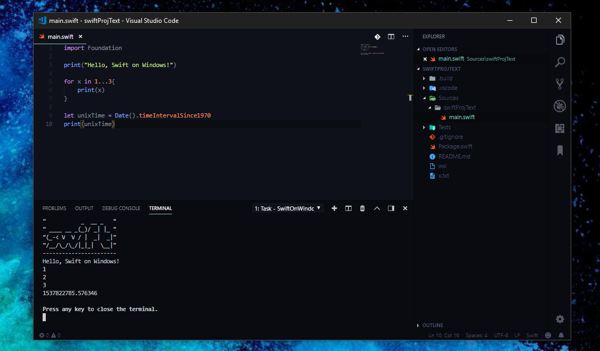

# Swift on Windows
    "           _  __ _   "
    " ____ __ _(_)/ _| |_ "
    "(_-< V  V / |  _|  _|"
    "/__/\_/\_/|_|_|  \__|"
    
    Compile and Build Swift Porject on Windows with the help of WSL

## Requirements
* Windows Subsystem for Linux (I have tried on Debian & Ubuntu Distro)
* Python2.7 on WSL
* (Optional) VSCode with [SwiftLanguage Extension](https://marketplace.visualstudio.com/items?itemName=Kasik96.swift)

## Installing Swift
Visit https://swift.org/download/ and check for the latest release.

    $ wget --no-check-certificat https://swift.org/builds/swift-4.2-release/ubuntu1604/swift-4.2-RELEASE/swift-4.2-RELEASE-ubuntu16.04.tar.gz

    $ mkdir ~/swift
    $ tar -xvzf swift-4.2-RELEASE-ubuntu16.04.tar.gz -C ~/swift

**Dependences** 

	$ sudo apt install python-swiftclient clang libicu-dev libpython2.7 libxml2 libcurl3 -y

**IF** you have problem getting `libicu`

	$ wget http://security.ubuntu.com/ubuntu/pool/main/i/icu/libicu55_55.1-7_amd64.deb
	$ sudo dpkg -i libicu55_55.1-7_amd64.deb
	$ sudo apt-get -f install

## Create a Project
    $ mkdir sampleProject && cd sampleProject
    $ ~/swift/usr/bin/swift package init --type executable

## Build & Run it manually

    $ ~/swift/usr/bin/swift build 
    $ ./.build/x86_64-unknown-linux/debug/sampleProject

## Easy Build & Run Using VSCode Task
I have writen a vscode task, so that I can build & run my code my project without opening terminal.
* [Get the `tasks.json`](https://raw.githubusercontent.com/yazdipour/swift_on_windows/master/sample/.vscode/tasks.json) and put it inside `yourProjectFolder/.vscode`
* Build & Run using `Ctrl+Shift+B`
* Be sure to have swift package at `~/swift/` (obviously you can change the directory inside `tasks.json`)

